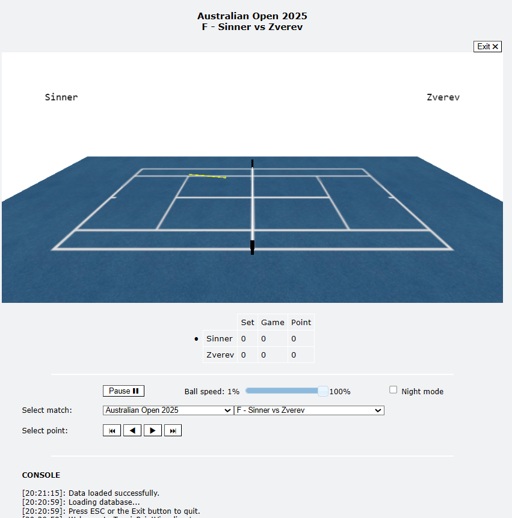

# Tennis Point Visualizer

Tennis Point Visualizer is a lightweight and interactive application that lets you experience professional tennis matches point by point. It leverages shot-by-shot data from the [Match Charting Project](https://www.tennisabstract.com/blog/2015/09/23/the-match-charting-project-quick-start-guide/), a remarkable initiative that systematically records pro tennis matches in a standardized format, making it possible to analyze patterns and strategies.

The app reads CSV files from the Match Charting Project and brings the match to life using [VPython](https://www.glowscript.org/docs/VPythonDocs/index.html), a simple yet powerful 3D animation library. While the data is not precise enough for exact meter-by-meter reconstruction of every shot, the main goal is to provide a clear and engaging visual impression of the flow, positioning, and dynamics of each point.

    

Within the application, you can:

- Select the tournament and match to visualize
- Run matches point by point, with full animation
- Control playback with play/pause, slow motion, and point navigation buttons
- Switch between day and night modes for the court
- Interact with the camera: zoom, rotate, and move freely
- View a live score table and follow the match progression

I am not a professional software developer, and this project started purely as a personal side hobby. It grew out of curiosity and a desire to explore Python, GUI development, and 3D animations in a hands-on, playful way. The goal has always been to learn by doing, experiment with visualizations, and create something fun and interactive.

## Installation

1.  Install dependencies from `requirements.txt` (need Python 3)

        pip install -r requirements.txt

2.  Run the program with

        python app.py

alternatively, you can use the `app.exe` file provided.

## Notes

- Since the data is not fully detailed, some shot trajectories are randomized to fill in missing information.
- The application is best used for exploring and understanding match dynamics, rather than precise statistics.
- The interface is simple and designed for clarity, with controls and score displays integrated around the 3D court.
- Some bits are still work in progress.
